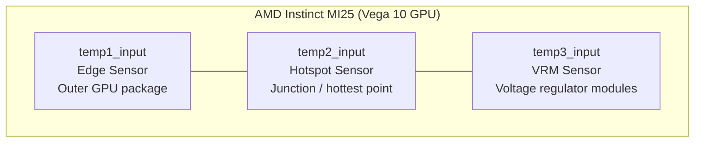
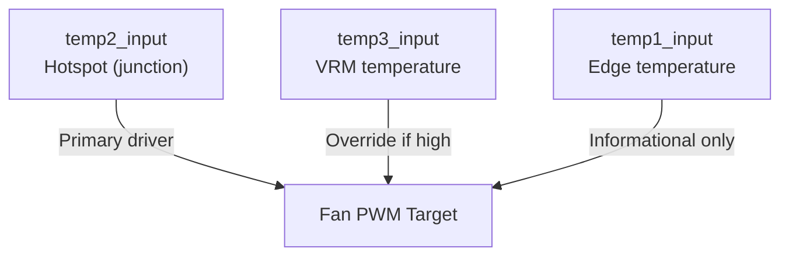
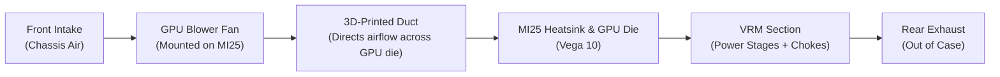

# AMD Instinct MI25 Fan Control

The AMD Instinct MI25 is a datacenter GPU.
It ships **without a fan**, but includes:
* mounting holes for a blower fan
* a 4‑pin GPU fan header

I designed and 3D‑printed a custom duct and installed a standard GPU blower fan.
However - at it turns out - the MI25 BIOS *cannot* be persuaded to properly control the fan.
This project provides **reliable, runtime fan control** using Linux’s **hwmon** interface.

## 🚀 Short version - install service to control the fan

Run the script **install.sh**, which:

1. Writes the executable file: ``/usr/local/bin/mi25-fan-control.sh``
2. Writes the *systemctl** service file for the **mi25-fanctl** fan control service.
3. Enables and starts the fan control service.

That's it, you are done. Feel free to ignore the remainder of this file.

## 🔍 Viewing MI25 Temperatures and Fan Data

To inspect MI25 sensors:
```sh
sh mi25-fan-show.sh
```

By default, the MI25 is assumed to be card1.
Note all the scripts assume the MI25 is "card1".
To override and use (for example) "card0":
```sh
CARD=0 sh mi25-fan-show.sh
```

## 🌀 Fan Control Scripts

The project includes several “actors” — different fan‑control strategies.
All scripts assume the MI25 is card1 unless overridden with CARD=0.

| Script | Features | Notes |
| --- | --- | --- |
| **mi25-fan-control-actor1.sh** | Simple threshold‑based control | Basic but functional |
| **mi25-fan-control-actor2.sh** | More advanced curve | Better ramp behavior |
| **mi25-fan-control-actor3.sh** | Adds smoothing + VRM override | Good for compute loads |
| **mi25-fan-control-actor4.sh** | Attempt at proper hysteresis |
| **mi25-fan-control-actor5.sh** | Adjusts less often and interpolates PWM in each stage | **Recommended**; used by systemd service |

Scripts can be run from the command line.
The first is somewhat simpler - and works.
The second is fancier. So is the third.
The fifth adjusts less often, and is also used for the fan control service.

## 🧠 How Fan Control Works

The MI25 exposes three thermal sensors via **hwmon**:

| Sensor | Meaning |
| --- | --- |
| ``temp1_input`` | Edge temperature |
| ``temp2_input`` | Hotspot temperature (most important) |
| ``temp3_input`` | VRM temperature (critical for stability) |

Fan speed is controlled by writing PWM values to:
```
/sys/class/drm/card1/device/hwmon/hwmon*/pwm1
```

The actors implement:
* hotspot‑driven PWM
* VRM override
* smoothing (slow down, fast up)
* hysteresis (actor4)
* 1‑second update loop

This avoids oscillation and keeps the MI25 cool under sustained compute workloads.

## 📐 MI25 Sensor Layout
The MI25 exposes three thermal sensors via the Linux hwmon interface.
These correspond to physical and functional locations on the GPU:
* **temp1_input** — Edge temperature (outer GPU package)
* **temp2_input** — Hotspot temperature (junction; rises fastest)
* **temp3_input** — VRM temperature (power delivery; can run hottest)

### Board Layout (Mermaid)



### Thermal Control Hierarchy


## 🌬️ Airflow Path (with 3D‑Printed Duct)


## ⚠️ About MI25 Firmware Fan Control (Dead End)

These scripts attempt to modify the MI25’s ATOMBIOS pp_table:
* mi25-fan-table-set.sh
* mi25-fan-table-boot.sh

You will need **upp** installed to use them.

First off, you do not want to go here.
All my experiments ended up with the MI25 (eventually) overheating, and rebooting the computer.
(Not what you want, presumably.)

### Why this doesn’t work
| Issue | Explanation |
| --- | --- |
| Firmware ignores fan fields | MI25 does not honor pp_table fan parameters |
| Modified pp_table unstable | Card eventually overheats and reboots the system |
| VBIOS flashing blocked | MI25 BIOS is signature‑protected |
| No reliable firmware fan control | All attempts lead to instability |

In short: firmware‑level fan control on the MI25 does not work.
Runtime control via hwmon is the only reliable solution.

When the proper **amdgpu** driver is loaded, it is possible to inspect and modify the AMD ATOMBIOS pp_table values, which includes fan control.
Though in the end, fan control in the MI25 BIOS just does not work.

You need **upp** installed. Expect this to cause you some grief.

Running **mi25-fan-table-set.sh** will extract, modify, and apply FanTable parameters in the pp_table.
There is a hex-encoded dump of the modified pp_table that can be pasted into **mi25-fan-table-boot.sh**.

The hope was to run **mi25-fan-table-boot.sh** at boot, and have the card running with proper fan control.

(Also tried modifying an MI25 BIOS and flashing - but could not flash the modified BIOS.)

As it seems fan control in the MI25 BIOS just does not work, this was all a dead end.

## 📦 Files in This Repository

| File | Purpose |
| --- | --- |
| ``install.sh`` | Installs systemd service + fan controller |
| ``mi25-fan-show.sh`` | Displays MI25 temperatures and fan data |
| ``mi25-fan-control-actor1.sh`` | Basic fan controller |
| ``mi25-fan-control-actor2.sh`` | Improved fan curve |
| ``mi25-fan-control-actor3.sh`` | Adds smoothing + VRM override |
| ``mi25-fan-control-actor4.sh`` | Adds hysteresis (maybe) |
| ``mi25-fan-control-actor5.sh`` | Interpolates PWM for each phase and dampens jitter (recommended) |
| ``mi25-fan-table-set.sh`` | Experimental pp_table modification (abandoned) |
| ``mi25-fan-table-boot.sh`` | Attempts to apply pp_table at boot (abandoned) |


